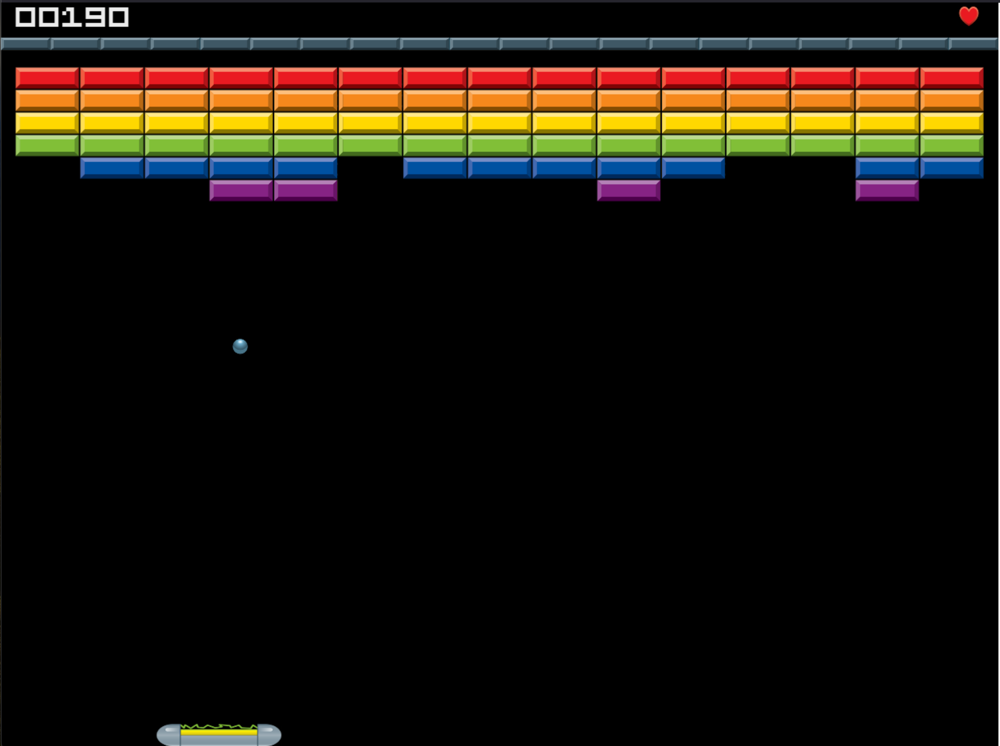

Simple breakout game written in JavaScript using HTML Canvas.

This is my first ever canvas game so wanted to understand how things work. This is a practice project for a larget Canvas based game I plan to create soon

# TODO
- [ ] Proper Game Over panel
- [ ] Proper You Win Panel with score
- [ ] Handle dropping bonus boxes (points)
- [ ] Handle multiple levels
- [ ] Handle multi balls
  - [ ] change lose life logic
  - [ ] track position and collision of multiple balls
- [ ] Refactor the game logic to WASM (Odin)

## Gameplay Screenshot

